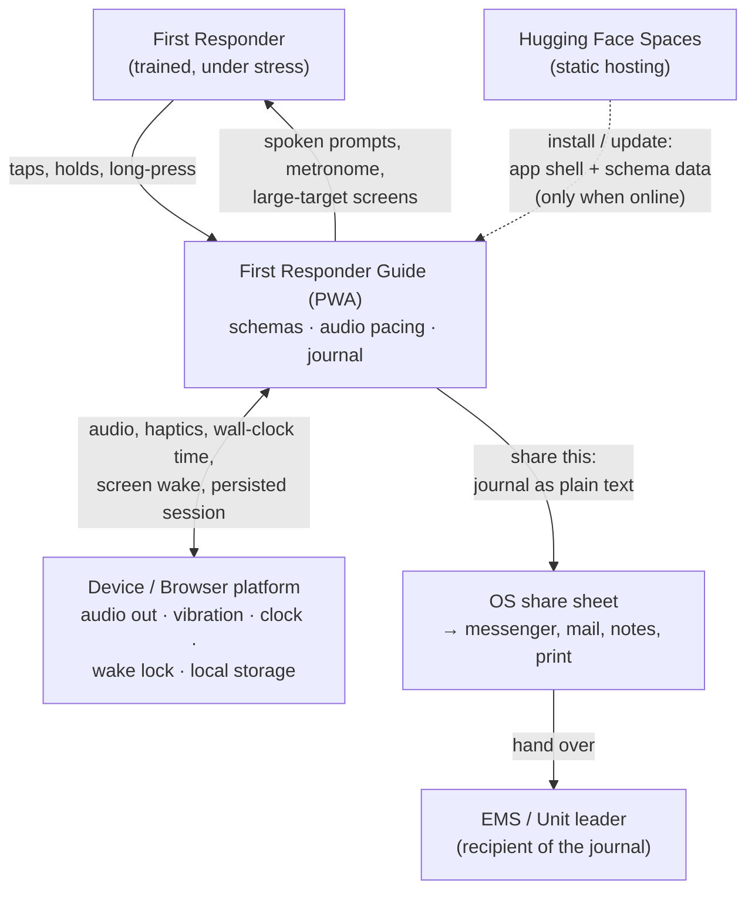

# CLAUDE.md — First Responder Guide (working title: "SanGuide")

Architecture spine, arc42-inspired. First thing read, last thing updated.
Status: Phase 1 (vision, quality goals, context). Sections 1.4 / 1.5 partially
filled; data model and flows follow with the first feature spec.

---

## 1.1 System vision

A PWA that guides a **trained first responder** (Sanitätsausbildung A level)
through emergency treatment schemas — above all cardiopulmonary resuscitation —
while the responder's hands are busy and their attention is on the patient. The
app carries the algorithm and the clock so the responder can carry the patient:
it paces compressions and ventilations by **audio**, prompts the AED steps, and
records every action with a timestamp into a **journal** that is handed over to
the arriving EMS via the device's share sheet.

### Main use cases

| # | Actor | Goal |
|---|-------|------|
| UC-1 | First responder | Start CPR guidance within one tap and be paced at 100–120 compressions/min with 30:2 ventilation cues |
| UC-2 | First responder | Be prompted through AED application (pads, analysis, shock, immediate resumption) without reading long text |
| UC-3 | First responder | Be reminded of the 2-minute helper rotation / rhythm-check cycle |
| UC-4 | First responder | Follow a non-CPR schema (unconsciousness, recovery position, choking, bleeding, shock) step by step |
| UC-5 | First responder | Record events (start CPR, shock delivered, ROSC, emergency call placed, medication/measure) with exact time, hands-free where possible |
| UC-6 | First responder | Hand the journal to EMS / document the deployment afterwards via "share this" |
| UC-7 | Responder in training | Run the same guidance in practice mode without polluting real records |

### Value proposition

Survival in cardiac arrest is a function of *time* and *quality*: compression
depth and rate, minimal hands-off time, prompt defibrillation. Under stress,
trained responders lose count, drift in rate, forget the 2-minute cycle, and
afterwards cannot reconstruct when what happened. Without this system: pacing
depends on the responder humming a song, the handover to EMS is a verbal guess,
and the deployment documentation is written from memory hours later. The app
does not replace training — it removes the bookkeeping load from a person who
needs every cognitive cycle for the patient.

### Explicit non-goals

- Not a training substitute; the app assumes a trained user.
- No diagnosis, no dosage recommendations, no triage decisions.
- No patient identity data, no accounts, no cloud sync, no telemetry.
- Not a medical device — informational guidance reproducing published schemas.

---

## 1.2 Quality goals

Ordered. Where two conflict, the higher one wins.

| # | Quality goal | Scenario (measurable) |
|---|--------------|----------------------|
| Q1 | **Availability / offline-first** | Device in airplane mode, first launch of the day: app opens from cache and reaches the CPR screen in < 2 s. Zero runtime network calls on any guidance path. |
| Q2 | **Usability under stress** | A trained user, kneeling, one hand free, glancing < 1 s at the screen: every action is on a target ≥ 12 mm, ≥ 1 primary action per screen, readable at arm's length in sunlight and at night. Any schema reachable from cold start in ≤ 2 taps. |
| Q3 | **Medical correctness & traceability** | Every guidance step traces to a cited source passage (San A 2021 / ERC guidelines) in the schema definition. Schema content is data, versioned, reviewable by a non-developer; guideline changes require no code change. |
| Q4 | **Timing accuracy** | Metronome drift < 50 ms/min with the screen off and the app backgrounded; cycle timers (2 min) and journal timestamps stay accurate across backgrounding, screen lock, and incoming calls. |
| Q5 | **Journal integrity** | Every recorded event survives a browser crash, tab kill, or battery-forced reload: after reload the running session resumes with a complete journal, ≤ 1 event lost. |
| Q6 | **Privacy by construction** | No data leaves the device except through an explicit user-initiated share. No identifiers collected, no analytics, no external asset loading at runtime. |

Deliberately *not* top-tier: visual polish, breadth of schemas, multi-language,
multi-device sync.

---

## 1.3 Stakeholders

| Role | Interest | What they need from the system |
|------|----------|-------------------------------|
| First responder (primary user) | Treat the patient correctly, stay legally safe | Loud, unambiguous pacing; no configuration; works with wet/gloved hands and no network |
| Second helper | Fetch AED, place emergency call | Audible cues that both helpers can follow; rotation prompt |
| Arriving EMS / emergency physician | Reconstruct what happened before arrival | A short, chronological, plain-text journal with absolute times — readable in seconds |
| Aid organisation / unit leader (operator) | Documentation of deployments, training quality | Exportable journal; practice mode separated from live records |
| Medical director / training officer | Guideline conformance | Schema content reviewable and versioned, with sources; visible "based on guideline X, version Y" |
| Legal / data protection officer | Liability, GDPR | No personal data processing; clear disclaimer that the app does not replace training or the emergency call |
| Developer / maintainer | Change the app without breaking guidance | Content–code separation; quality signals in CI |
| Hosting platform (Hugging Face Spaces) | Static hosting constraints | Pure static assets, no server runtime, no secrets |

---

## 1.4 System context

The app is a black box with **one outgoing user-facing interface: "share this"**.
Everything else is either device capability or one-time delivery of the app
itself.

### Interface catalogue

| # | Partner | Direction | Content | Notes |
|---|---------|-----------|---------|-------|
| I-1 | First responder | in/out | Touch input; audio + visual guidance | Only interactive interface during an incident |
| I-2 | OS share sheet (Web Share API) | out | Journal as plain text (fallback: clipboard copy / file download) | **The only data-out interface.** User-initiated, never automatic |
| I-3 | Hugging Face Spaces | in | App shell, schema definitions, audio assets | Delivery/update only, never during guidance (Q1) |
| I-4 | Device platform | in/out | Web Audio, Vibration, Wake Lock, `Date.now()`, IndexedDB/localStorage | Capability, not an external system; degrade gracefully if unavailable |

**Not in context:** no backend, no database server, no telemetry, no emergency-call
API, no AED connectivity, no map/location service, no authentication provider.

---

## 1.5 Technology choices (initial)

| Decision | Chosen | Alternatives considered | Rationale |
|----------|--------|------------------------|-----------|
| Delivery | Installable PWA, offline-first service worker | Native app, plain website | Q1 offline + home-screen launch without app-store gatekeeping; one codebase |
| Hosting | Hugging Face Spaces, static | GitHub Pages, Netlify, own server | User-set constraint; static-only is compatible with "no backend" |
| Stack | Vanilla HTML/CSS/JS, no framework, no build step | React/Vue/Svelte, Vite | User-set constraint; smallest possible cache footprint, no toolchain rot, auditable by medical reviewers |
| Audio pacing | Web Audio API scheduled clicks + pre-rendered/synth speech | `setInterval` + `<audio>` | Q4 drift requirement; `setInterval` drifts and throttles when backgrounded |
| Persistence | IndexedDB for journal, append-on-write | localStorage, in-memory | Q5 crash resilience; localStorage is synchronous and size-limited |
| Schema content | Declarative JSON/JS data files, versioned, source-cited | Hard-coded screens | Q3 reviewability without code changes |

*Open decisions are tracked with the first feature spec (Phase 3).*
